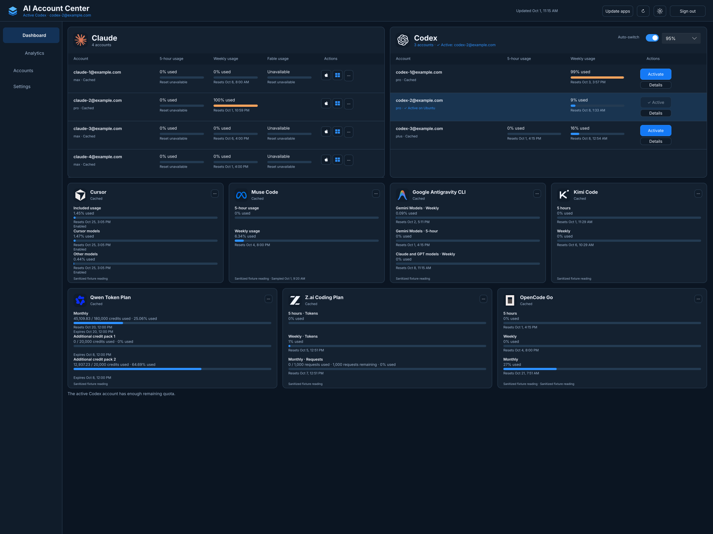
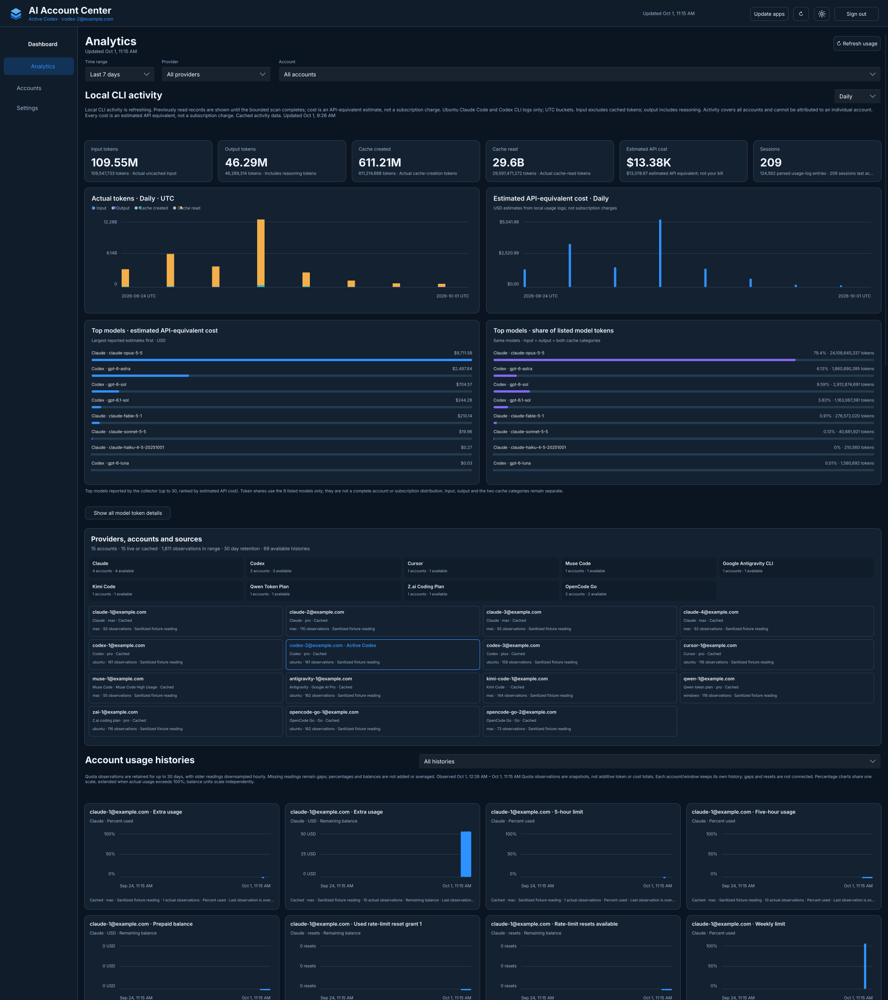

# AI Account Center

AI Account Center manages existing AI accounts and their subscription usage in
one place: a browser dashboard with Home, Analytics and Accounts & Settings
pages, plus native Mac and Windows trays that show the same accounts. It
switches saved Codex logins on the shared Ubuntu runtime under a guarded
transaction, opens configured Claude profiles on Mac or Windows, and runs
explicit, allowlisted updates of the installed provider apps. The browser
dashboard is Slint 1.18.1 compiled to WebAssembly; the backend remains
TypeScript.

This is the continuing fork of [CCS](https://github.com/kaitranntt/ccs), now at
[sittingmongoose/ai-account-center](https://github.com/sittingmongoose/ai-account-center).
Repository history, original authorship, copyright and the [MIT license](LICENSE)
are preserved. This README documents the round-2 tree on
`integrate/aac-round2-final-20261002`; the installation below checks out that
branch explicitly. The repository default branch is managed independently.

## Dashboard pages

The dashboard serves three pages (`/`, `/analytics`, `/accounts`) with a
sign-in page when its own login is configured.

- **Home** shows Claude, then Codex and Antigravity as switchable sections,
  then one card per account of the other providers (Cursor, Muse Code,
  Kimi Code, Qwen, Z.ai, OpenCode Go). Meters show provider-reported
  percentages with severity colours, the auto-switch threshold notch and
  reported overage. A missing reading is drawn as unavailable, never as zero.
  Fable appears only for Claude Max plans, from the `seven_day_fable` window.
  A window whose reset time has passed while its reading predates the reset
  reads "Reset at 10:15 AM · new reading pending" over a dashed track until a
  newer reading arrives. Clicking a row opens Details with every visible quota
  window, balance, reset and expiration.
- **Analytics** keeps the Usage page: range presets (24H, 7D, 30D, Month, All)
  and custom ranges, a Claude Code / Codex filter, KPI cards, the usage-trends
  chart, cost by model, the model donut, sessions, token breakdown, cache
  efficiency, a weekday x hour heatmap, daily cost by provider, quota history
  and the resets agenda, all in local time. Ubuntu Claude Code and Codex CLI
  logs provide token and activity charts with API-equivalent cost estimates;
  those estimates are not subscription charges or billing attribution.
- **Included usage** in the Analytics header lists every CLI log source behind
  the Usage totals and each source's state and last scan. Besides Claude Code
  and Codex on Ubuntu, the totals count OMP, Muse Code and zcode logs from
  Ubuntu, Mac and Windows, merged by model only. They are sources, never a
  provider, filter or legend; the per-provider session rows and daily chart
  stay Claude Code and Codex. Cost with no logged amount and no listed rate
  reads "Not logged", never $0.00, and totals that leave it out say "partial".
- **Accounts & Settings** lists every provider with its accounts: status,
  last sample, how it signs in, and fixed action slots. Codex and Antigravity
  Activate, Claude Open on Mac or Windows, the Codex and Antigravity
  auto-switch policies, the usage-refresh interval and the appearance are
  live, and so is every sign-in and sign-out control the server offers. The
  settings column holds the Dashboard sign-in block, Update apps results by
  computer, read-only connection facts and About (with the standard
  `AboutSlint` widget).

## Visibility switches

Each provider and each account has two independent switches on
Accounts & Settings, both saved on the server: **Show on dashboard** and
**Show in tray**. The dashboard follows only `providers[].visible` and
`accounts[].hidden`; the trays follow only `providers[].trayVisible` and
`accounts[].trayHidden`. Each account can therefore be shown in both, on one
only, or in neither. The two lists are stored as four independent lists, so a
dashboard switch never changes a tray list and the reverse holds. Hidden
accounts are still collected and stay auto-switch candidates.

## Account add, sign-in again and remove

What a control may do comes from the server. A control is live, off with its
reason in plain words, refused (the click opens the reason and sends nothing),
or marked "coming" where the server has no flow or route yet.

| Provider | Add | Sign in again | Remove |
| --- | --- | --- | --- |
| Claude | A profile on Mac and Windows, then guided sign-in in the provider app | Guided app sign-in; Open on Mac or Windows from the row | To the 30-day trash, with Restore; a computer's default Claude profile is never offered for removal |
| Codex | Device code on Ubuntu, with the page, code and Cancel | Device code again; the identity must be unchanged | With confirmation; the active, default and last profiles cannot be removed |
| Antigravity | Supervised CLI login on the dashboard host (below) | The same supervised login for a saved, non-live profile | Deletes the saved login; no trash |
| Cursor | Guided app sign-in (one account) | Guided app sign-in, Open on Mac | With confirmation |
| Muse Code | Re-check is live; sign-in reads "coming" | Re-check | With confirmation |
| Kimi Code, Z.ai, OpenCode Go | API key in a masked field; only its last 4 are shown afterwards | Replace key | Deletes the stored key |
| Qwen | Guided browser-extension sign-in on Windows | Guided sign-in, Re-check | With confirmation |
| OpenCode console wallet | Guided browser-extension on Mac | Guided sign-in | Not served |

Antigravity add and sign-in again run the official CLI as a supervised job on
the dashboard host, inside the same isolated sign-in home as the terminal
command: the panel shows the Google sign-in page, you paste back the code
Google gives you, and the account appears once the CLI is stopped and the new
login is verified. Add is live whenever that isolation check passes on the
dashboard host and the connection is trusted.

Where the check cannot run (no `agy`, no bubblewrap, no unprivileged user
namespace) or the connection is not trusted, both answer with the terminal
command on Ubuntu, which the dashboard shows verbatim:

```bash
ai-account-center antigravity signin <profile>
```

Claude add, remove and restore need the server's Claude host steps
(`CCS_CLAUDE_HOST_LIFECYCLE=on` for that server process). The live service
keeps them off, so those controls read "coming" there. The default-profile
refusal (409 `account_protected`) holds either way. A just-added pending
Claude profile cannot be opened from its row; open "Claude (\<id\>)" from
Applications or the Start menu.

## Dashboard sign-in, devices and pairing

The dashboard has its own username and password login for browsers, separate
from provider logins. The sign-in page shows tries left after a wrong
password, a countdown while paused, and whether the session ended or was
signed out from another browser.

- **Password change** (Settings > Dashboard sign-in) needs a secure
  transport. It offers "Also sign out other browsers" (on by default) and
  names the paired trays that stay signed in; a password change never signs
  out a paired tray.
- **Devices.** Each tray pairs once with the dashboard password and then uses
  its own revocable device key. The dashboard lists paired trays with Revoke,
  plus Sign out other browsers and Sign out all devices. Keys rotate after
  30 days and expire after 90 days unused.
- **"Trust this local network"** (Settings > Dashboard sign-in) is off by
  default. When it is on, plain HTTP from a peer in the trusted networks
  counts as secure for password change, LAN first-run setup, device pair and
  rotate, key add and replace, sign-in job create and auth-code submit. The
  default trusted networks are 10/8, 172.16/12, 192.168/16 and fc00::/7;
  `dashboard_network.trusted_networks` in config.yaml is a CIDR list that
  replaces them. Turning trust on is allowed only from the dashboard computer
  itself (loopback) or by editing the config file; turning it off is allowed
  from any signed-in browser. The page shows "This connection: \<peer\>,
  trusted local network", "not trusted", or "this computer" on loopback.
- **Plain HTTP and WireGuard.** The dashboard stays on plain HTTP at its LAN
  address; there is no HTTPS. The risk, stated plainly: when trust is on,
  passwords, keys and sign-in codes cross the home network without
  encryption. It works over a WireGuard VPN when its clients arrive from a
  private range (for example the router's 10.6.0.x client subnet) or
  translated to the router's private address; an unusual VPN subnet can be
  added to `trusted_networks`. Public, link-local, CGNAT and unknown peers
  stay refused unless listed, and proxy headers never carry trust.

## Native trays

The Mac menu bar app and the Windows tray app show the same accounts and
usage, with Claude launch controls and guarded Codex activation and
auto-switch settings. Both honour only the "Show in tray" switches. Each
tray pairs once over the trusted local network: the password is sent once,
the new key must answer before anything is saved, and the stored password is
then deleted. A password change on the dashboard leaves paired trays signed
in. Re-pair replaces the key only after the new one works and is saved, and
Disconnect revokes the key and returns to the first-run screen.

- **Sign-in screen.** Both trays replace the list with a sign-in screen on
  first run, after a remote sign-out, during Re-pair and after Disconnect.
  It covers the setup code, pairing in progress, "not on your local
  network", "pairing is turned off", wrong password with tries left, rate
  limited with a countdown, unreachable or wrong address, the upgrade from a
  stored password, signed out (revoked, sign out all devices, expired), and
  success with the hand-off into the list. A new tray starts with an empty
  address field (placeholder `http://`).
- **Mac menu-bar setting.** Settings > Menu bar chooses which reading the
  menu bar shows: any provider in the data, or Nothing for the icon alone;
  the Claude account when Claude is chosen; and Used or Remaining of the
  5-hour window, else the weekly one. Codex and Antigravity follow the active
  account. A reset-pending or unavailable reading shows the icon with no
  number, never 0%.
- **Reopening the trays.** On the Mac, click the menu-bar glyph (clicking it
  again closes the panel), relaunch the app from Spotlight, Launchpad,
  Finder or the Dock, or press Option-Command-A from any app (on by default;
  Settings > Open shortcut can turn it off). On Windows, use the Start menu
  or Desktop shortcut, or press Ctrl+Alt+A while the tray runs (optional;
  Settings > Keyboard shortcut). A second launch hands over to the running
  tray (single instance) and shows its panel.

The [Mac guide](macos-bar/README.md) and [Windows guide](windows-bar/README.md)
describe private storage, startup preferences, compatibility aliases and
rollback.

## Update apps and Cancel

**Update apps** (the header button, with results in Accounts & Settings)
starts one allowlisted, asynchronous job for the installed provider apps:
Antigravity CLI, Muse Code, OMP, Codex CLI, Claude Code, Codex Desktop and
Claude Desktop. Ubuntu runs locally; the remote targets are the existing
`jared-mac` and `jared-windows` SSH aliases. Helper deployment and the
existing Windows interactive task are required for remote updates. Absent
apps are skipped; per-app readiness checks tell unknown from failure, and an
unreachable computer reports Unknown rows. No update runs merely by opening
the dashboard or reading its status. See
[app update setup and behavior](scripts/app-updates/README.md).

**Cancel** is offered while a run is going. It is acknowledged at once: the
running computer's batch always finishes (installers are never killed) and
the queued computers are skipped ("Skipped: cancelled"). Cancel granularity
is one computer's batch, and Cancel never promises an undo.

## Antigravity switching

Antigravity usage rows and saved-profile management are live, but account
switching is not enabled in this tree. Four independent gates hold it
closed: the dashboard release flag, the runtime release file, the runtime
installation and adoption, and the auto-switch setting (off by default).
`ai-account-center antigravity status` reports each gate read-only and names
the next step. Switching is released only after the live test (idle Ubuntu
`agy` switches to the party account and back); any other result keeps
switching off. The exact release, verify, live-test and rollback steps are in
[the Antigravity runtime guide](docs/antigravity-runtime.md).

## Dashboard previews

These screenshots show the actual compiled Slint 1.18.1 UI in a Mac browser,
using validated local fixture responses. Account identities are sanitized;
the quota readings and observed history retain their source values from the
2026-10-01 15:15 UTC snapshot. That earlier snapshot has no Fable Max readings,
so those slots remain unavailable. These previews show the compiled interface;
they do not prove current live-provider availability or deployed-backend behavior.



Dashboard preview: nine providers, Claude/Codex controls and complete usage cards.
Muse preserves the original sample time for its cached reading. No real account
emails or credentials appear.



Analytics preview: actual CLI token/activity charts, API-equivalent estimates,
model plots, a combined provider/account/source overview and separate observed
histories. All 15 fixture accounts contribute 69 available histories; gaps are
preserved. See
[screenshot provenance](assets/screenshots/README.md).

## Platforms

| Component | Platform and requirements |
| --- | --- |
| Dashboard server / CLI | Node.js 22, matching CI, on Linux, macOS or Windows; local source builds also need Bun and the Slint toolchain below |
| Browser dashboard | Mac or Windows browser with WebGL2 and hardware acceleration; served by the dashboard server |
| Mac menu bar | macOS 26+, Xcode 26+ for source installation |
| Windows tray | Native .NET 10 WPF, Windows x64; source builds require an existing .NET 10 SDK |
| Shared Codex activation / auto-switch | Existing configured Ubuntu Codex runtime and saved logins |
| Usage collectors / app updates | Existing credentials and installed apps on the configured owner host; Python and approved SSH transport where needed |

Cross-platform source support does not make every account action available on
every host. The dashboard reports available capabilities. A container does not
provide another computer's provider sessions or native apps.

## Install from current source

There is no published npm package or registry image required for this installation.
Use the documented branch explicitly:

```bash
git clone --branch integrate/aac-round2-final-20261002 https://github.com/sittingmongoose/ai-account-center.git
cd ai-account-center
bun install --frozen-lockfile
```

The source build needs Rust **1.92+**, the `wasm32-unknown-unknown` target and
`wasm-pack`, in addition to Node.js 22, npm and Bun. Both `slint` and `slint-build`
are locked to **=1.18.1**. Install the tools using their official guides:
[Node.js and npm](https://nodejs.org/en/download),
[Bun](https://bun.sh/docs/installation),
[Rust/rustup](https://rust-lang.org/tools/install/) and
[wasm-pack](https://github.com/wasm-bindgen/wasm-pack#installation).
The repository's package-manager declaration is Bun 1.3.9. With those tools installed:

```bash
rustup target add wasm32-unknown-unknown
bun run build:all
bun run validate
bun run ui:validate
node dist/ccs.js dashboard --host localhost --port 3000 --no-open
```

Open [http://localhost:3000](http://localhost:3000). Running from the checkout
is enough to use the dashboard. For a server on a separate Ubuntu computer,
use its existing authenticated dashboard address or approved port forward from
your Mac/Windows browser; localhost refers to the computer running the browser.
To install the primary command globally from
this same checkout's local package:

```bash
./scripts/dev-install.sh --npm
ai-account-center dashboard
```

The installer builds and validates the source, creates a tarball and installs
that local tarball. It keeps the artifact for reinstall/rollback. `--bun` selects
Bun's global package directory. Use a user-owned global prefix; the Windows server
can be run directly from the built checkout, or the same local tarball can be
installed with npm. This repository does not fetch the upstream CCS npm package
as its installer.

See [Contributing](CONTRIBUTING.md) and the
[Slint dashboard guide](web-dashboard/README.md) for build ownership and checks.

## Set up and run

The default dashboard bind is localhost. Specify a port when a fixed address is
needed; otherwise the command selects an available port. Linux does not open a
browser automatically. Configure the dashboard's own login before exposing it
to other computers:

```bash
ai-account-center dashboard auth setup
ai-account-center dashboard auth show
ai-account-center dashboard --host localhost --port 3000 --no-open
```

`auth setup` prompts for dashboard credentials; these are separate from provider
logins. Existing `CCS_DASHBOARD_AUTH_ENABLED`, `CCS_DASHBOARD_USERNAME` and
`CCS_DASHBOARD_PASSWORD_HASH` overrides remain compatible. Keep credentials and
hashes private. Browser requests use the same server origin and authenticated
session. Each tray pairs once with the dashboard password and then keeps its
own private device key; see the tray guides and the pairing section above.

Existing account/profile data remains under `~/.ccs/`. `--config-dir` and
`CCS_DIR` select that directory directly; legacy `CCS_HOME` selects an alternate
home and appends `.ccs`. Claude/Codex account services use existing profiles and
native login data. To save a current Codex native login without changing its source:

```bash
ai-account-center codex-auth import-default personal
ai-account-center codex-auth show
```

Additional provider collectors run on the host that owns the corresponding login.
Their source selection is the private `account-usage-sources.json` configuration,
or the newer `account-usage-accounts.json` (registry v2, several accounts per
provider) when that file exists; existing approved SSH aliases select remote
Mac/Windows collectors. Missing
credentials or collector setup yields unavailable usage. Follow the
[provider boundaries](docs/system-architecture/provider-flows.md),
[collector requirements](scripts/account-usage/README.md),
[OpenCode/Muse bridge](browser-bridge/opencode-muse/README.md) and
[Qwen bridge](browser-bridge/qwen/README.md) for the applicable existing source.
Do not copy account secrets into this repository or container images.

Claude desktop launch mappings use the private `claude-desktop-profiles.json`
configuration and the existing profile IDs. The optional
`opencode-console-wallet-source.json` adds a distinct workspace wallet source.
These are existing deployment contracts, not generic account creation forms;
another computer needs its own valid sessions and configured launch mappings.

For native companions, build/install as the target user:

```bash
# macOS, from this checkout
cd macos-bar
swift build -c release
swift run ccs-bar-check
./Scripts/package_app.sh
./Scripts/install_user.sh --launch
```

```powershell
# Windows PowerShell, from this checkout
cd windows-bar
./scripts/Build.ps1
./scripts/Check.ps1
./scripts/Install.ps1
```

On first run the tray asks for the dashboard address, then pairs with the
dashboard login; the stored password is deleted once the device key works.
Mac installs to `~/Applications/AI Account Center.app`; Windows installs to
`%LOCALAPPDATA%\AI Account Center\app\AIAccountCenter.exe`.
The [Mac guide](macos-bar/README.md) and [Windows guide](windows-bar/README.md)
describe private storage, startup preferences, compatibility aliases and rollback.
Windows source setup requires the [.NET 10 SDK](https://dotnet.microsoft.com/en-us/download/dotnet/10.0),
not only the runtime. Build/Check use an explicit `-Dotnet` path, an existing SDK
on PATH, or the existing private per-user SDK; installation stages the built app.
On Mac, `ai-account-center bar install --launch` can also build/install the native
sources included in the local package; `ai-account-center bar` starts or reuses
its local dashboard and opens the installed app.

## Current commands

| Command | Purpose |
| --- | --- |
| `ai-account-center dashboard` | Run the Slint dashboard; options `--host/-H`, `--port/-p`, `--no-open` |
| `ai-account-center dashboard auth setup/show/disable` | Manage dashboard login; `status` aliases `show` |
| `ai-account-center codex-auth create/login/import-default` | Manage saved Codex logins; native login uses the provider's own CLI |
| `ai-account-center codex-auth show [name]` | Inspect saved logins; `list` and `status` are aliases |
| `ai-account-center codex-auth activate <name>` | Guarded activation of the shared native login |
| `ai-account-center codex-auth remove <name>` | Remove an inactive saved login with confirmation; `--force` overrides only saved-default protection |
| `ai-account-center antigravity signin <profile>` | Sign in an Antigravity profile from a terminal on Ubuntu |
| `ai-account-center antigravity status` | Read-only report of the Antigravity switching gates |
| `ai-account-center bar` | Mac local dashboard/app launch; `serve`, `stop`, `status`, `install`, `uninstall`, `version` are available |
| `ai-account-center help` / `version` | Current command help / product version |

`--config-dir PATH` selects the existing account configuration directory.
Use `ai-account-center help dashboard`, `help codex-auth`, `help antigravity` or `help bar` for options.
`ccs` runs the same retained commands; **`ccs config` remains the dashboard alias**.
The [Codex guide](docs/codex-auth.md) documents import/resource compatibility and
[activation review](docs/activate-in-place.md).

## Update and recovery

To update AI Account Center, keep a private configuration backup and the prior
local tarball/app, then update your clean product checkout on
`integrate/aac-round2-final-20261002`, install its locked dependencies and rerun the same
local installer:

```bash
git pull --ff-only
bun install --frozen-lockfile
./scripts/dev-install.sh --npm
```

Rebuild/reinstall native apps with their commands above. Rebuild a Docker
installation with its existing Compose command. Existing private account data,
native connections and startup preferences are retained; keep prior artifacts
and volumes for rollback. A visibility file written by this build adds
`trayHiddenAccountIds`; an older rolled-back build reads it as "could not be
read safely" until its next full save, so save the visibility once from the
rolled-back page if that matters. Local changes should be reviewed before pulling.
`ai-account-center update` is retired and cannot update from the upstream package.

## Existing CCS installations

Preserve `~/.ccs/`, `CCS_HOME`, profile/provider IDs, session aliases, native
messaging identities and account capsules. Adopting the new visible name does
not require renaming private directories or copying credentials.

`ccsx`, `ccs-codex`, `ccsd`, `ccs-droid` and `ccsxp` are retained retirement-guidance
stubs. They no longer launch or route AI runtimes. `codex-auth use/switch` no
longer prints shell exports. Use `codex-auth activate` for shared login selection,
and a provider's own CLI for an AI session. Old routing/API-profile/proxy examples
remain upstream history rather than current setup instructions.

<!-- quickstart-snippet-start -->
## Quick Start (Docker)

From a checkout of [AI Account Center](https://github.com/sittingmongoose/ai-account-center):

```bash
docker compose -f docker/compose.yaml up -d --build
```

Open [the dashboard](http://localhost:3000). This builds the local source image;
it does not download the upstream CCS package or start a CLIProxy service.
Existing host credentials and usage-collector connections require explicit
configuration; see the Docker deployment guide in this checkout.
<!-- quickstart-snippet-end -->

See the [Docker guide](docker/README.md) for loopback access, authentication,
private volumes, explicit host-collector configuration and rollback. Container
instructions build the local dashboard image; they do not deploy native apps.

## Verification and development

```bash
bun run validate
bun run test:all
bun run ui:validate
```

The actual WASM build compiles Slint bindings and packages the UI at `dist/ui/`.
Offline fixture tests validate contracts and guards; they do not prove live
provider availability, successful app replacement or access to another computer.
Native checks and any live verification have their own scopes in the linked
guides. Current validation results belong to the tested revision and artifact.
Release verification is still in progress on this product branch.
Antigravity account switching is not enabled in this tree; its gates, release
steps and the required live test are documented in
[the Antigravity runtime guide](docs/antigravity-runtime.md).

Preserving an actual native conversation through switching still requires
verification. Vendor update/restart checks use controlled fixtures and do not
establish that every installed vendor app has undergone a live update.
The [test guide](tests/README.md) and [maintainer docs](docs/README.md) describe
retained checks and source owners.

Report product issues at
[AI Account Center issues](https://github.com/sittingmongoose/ai-account-center/issues).
Keep tokens, cookies, real account details and private configuration out of public
issues and screenshots. See [Security](SECURITY.md) for reporting boundaries.

## Known limits

- Antigravity and Cursor usage are not available locally: Antigravity usage
  lives only inside its conversation-database blobs, and Cursor usage is
  server-side only. Both read as fixed "no local usage log" entries in
  Included usage.
- Update apps Cancel granularity is one computer's batch: the running
  computer's apps finish and the queued computers are skipped.
- Claude add, remove and restore read "coming" while the server's Claude host
  steps are off (the live service keeps them off); the default-profile
  refusal holds either way.
- Antigravity add and sign-in again run the supervised CLI login on the
  dashboard host, which needs Ubuntu there with the official `agy` CLI,
  bubblewrap and an unprivileged user namespace, plus a trusted connection
  for the pasted code; without them the dashboard shows the terminal command
  instead. Muse Code sign-in reads "coming" (Re-check is live).

## Attribution

The original CCS project was created by **Tam Nhu Tran (Kai)** and the **CCS
Contributors**. Original package author metadata and
`Copyright (c) 2025 CCS Contributors` remain under the unchanged
[MIT license](LICENSE). Upstream source/history remain at
[kaitranntt/ccs](https://github.com/kaitranntt/ccs).

Slint 1.18.1 uses its royalty-free license; the dashboard retains the standard
AboutSlint widget. See [dashboard licensing](web-dashboard/README.md#dependencies-and-attribution).
Provider artwork retains its [source and attribution notices](web-dashboard/public/assets/THIRD-PARTY-NOTICES.txt).
Original CCS routing work credited
[claude-code-router](https://github.com/musistudio/claude-code-router), and the
original project used [ClaudeKit](https://claudekit.cc).

## Community Projects

[opencode-ccs-sync](https://github.com/JasonLandbridge/opencode-ccs-sync), by
[@JasonLandbridge](https://github.com/JasonLandbridge), serves the original CCS
provider configuration. This preserves its original project credit and does not
imply current dashboard integration.

## Star History

[AI Account Center repository](https://github.com/sittingmongoose/ai-account-center)
and [original CCS history](https://star-history.com/#kaitranntt/ccs&Date).
