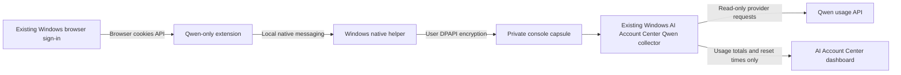

# AI Account Center Qwen Usage Bridge for Windows

This bridge reuses the Qwen console account already signed in to the selected Brave or Chrome profile. It obtains cookies through the browser's supported extension API, saves them using that Windows user's DPAPI protection, and lets the existing AI Account Center Qwen reader fetch real usage. No cookie or token is sent to the VM, dashboard, or another computer.

The extension is installed in Brave, and the existing session fetches real Qwen usage, including individual credit-pack balances and expiry times. Version **0.1.3** updates the visible name to AI Account Center. The pinned extension identity, permissions, native helper and protected sign-in remain the same. No new browser permission, login or usage sync is needed for this branding update.

## Reload the installed extension

Open `brave://extensions` in the signed-in Windows Brave profile, find the existing **CCS Qwen Usage Bridge** card, and click its **Reload** button. It will appear as **AI Account Center Qwen Usage Bridge**. The extension ID remains `clobbdmblhillanldmmjnlpbaafbnklj`. The existing browser sign-in and saved usage are retained; automatic refresh continues.

## Activate in the signed-in browser profile

After the ordinary native helper installer is deployed:

1. In the Windows Brave profile that is signed in to Qwen, open `brave://extensions`.
2. Enable **Developer mode**, choose **Load unpacked**, and select the installed extension under `%LOCALAPPDATA%\CCS\QwenUsageBridge\extension` for the current Windows user.
3. Open **AI Account Center Qwen Usage Bridge** and click **Sync usage**, or wait one minute for its first automatic refresh. Select China only if the existing account uses the China Model Studio console.

The normal extension permission covers six exact Qwen/Aliyun parent, console and gateway hosts. The parent hosts are necessary because the browser checks the cookie's own domain. HTTP/HTTPS cookie permissions are necessary because Qwen's login ticket lacks the Secure attribute; the collector's requests still use fixed HTTPS URLs only. It refreshes every five minutes while that browser is open. It never opens a login page, changes the browser account, or switches a coding account. An expired console sign-in is reported as unavailable rather than as zero usage.

Chrome's supported unpublished-extension path is [Developer mode and Load unpacked](https://developer.chrome.com/docs/extensions/get-started/tutorial/hello-world). Brave also requires ordinary [extension installation permission](https://support.brave.app/hc/en-us/articles/360017909112-How-can-I-add-extensions-to-Brave). No force-install policy, browser preference edit, process injection, or app-bound cookie decryption bypass is provided.

## Native helper deployment

Run `install-native-host.ps1 -ValidateOnly` to inspect its fixed package and target paths. Run `install-native-host.ps1 -Install` to copy the published helper and extension to `%LOCALAPPDATA%\CCS\QwenUsageBridge`, update the bundled v2-compatible `plan_common.py`/`plan_usage.py` collectors under `%USERPROFILE%\.ccs\account-usage`, and register the exact `com.ccs.qwen_usage_bridge` native host for the current user's Brave and Chrome. This does not install, enable, reload, or force the extension.

The existing Python AI Account Center collectors must already be installed under `%USERPROFILE%\.ccs\account-usage`. The fixed interpreter is `C:\Program Files\Python313\python.exe`; .NET 8 runtime is required and is already present on this Windows computer.

The extension ID is pinned by a public manifest key:

```text
clobbdmblhillanldmmjnlpbaafbnklj
```

Only `chrome-extension://clobbdmblhillanldmmjnlpbaafbnklj/` is admitted by the native manifest and the native host's caller validation. The public key identifies the extension; no signing private key is retained in this project.

## Data flow



The capsule is `%USERPROFILE%\.ccs\account-usage\qwen-console-session.json`, containing `version: 2`, `region` and `cookiesDPAPI`. Its encrypted JSON contains separate `consoleCookie` and `gatewayCookie` headers. It has a protected current-user/SYSTEM file ACL and holds encrypted data only. The existing Python reader decrypts it in memory on Windows and calls the fixed console endpoints. The helper remains compatible with the earlier single-header `cookieDPAPI` capsule. No refresh token is copied or rotated.

Console and gateway headers are computed independently with cookie domain/path/expiry rules. Host-only/path-only cookies reach only their applicable fixed endpoint; they are never widened to the other host. The provider decides whether those cookies authenticate the account, so a changed login-cookie name cannot create a false missing-login error. There is no cookie export button or arbitrary URL, file, command, host, or credential parameter. Browser diagnostics store counts and the selected region only.

Only a strictly projected `DashboardAccount` DTO is returned to the extension and saved as `%USERPROFILE%\.ccs\account-usage\qwen-browser-usage.json`. It preserves real 5-hour/weekly/monthly limits, additional credit-pack balances and expiry, available extra-credit counters, and subscription expiry separately from reset time. Individual pack keys use exactly `addon-pack-` plus 12 lowercase hexadecimal characters and receive fixed indexed labels; up to 100 packs and 107 total rows are accepted. Unknown fields remain null. Neither browser storage nor stdout/error messages retain upstream payloads, cookies, CSRF values, or secrets.

Native messaging follows the [official Chrome protocol](https://developer.chrome.com/docs/extensions/develop/concepts/native-messaging): length-prefixed UTF-8 JSON, fixed native host and exact allowed origin. [The browser cookies API](https://developer.chrome.com/docs/extensions/reference/api/cookies) owns cookie access after normal installation; locked databases and v20 encryption do not need to be opened by AI Account Center. [Anthropic's official browser integration documentation](https://code.claude.com/docs/en/chrome#extension-not-detected) also documents the Windows Brave native-host registry location used here.

## Checks

```sh
node --test tests/bridge-core.test.mjs tests/service-worker.test.mjs tests/popup.test.mjs
```

The extension's thirty offline checks cover the missing parent-domain/non-secure-cookie permission, domain/expiry restrictions, all-path queries, header-injection rejection, deduplication, unknown quota, a live-shaped pack inventory, dynamic-key/count limits, expiry/reset separation, metadata projection, concurrent collection, stale region/cookie generations, bounded historical display, fixed errors and caller restrictions. The PowerShell installer parses successfully in Windows PowerShell 5.1. Native-helper checks, Windows build evidence and hashes are recorded in the native-host directory. Actual live collection is verified separately after installation; offline fixtures alone do not establish a live provider response.

## Official CLI alternative

The official QwenCloud CLI also supports a normal device authorization flow. On a computer holding the browser sign-in, initialize it with `qwencloud auth login --init-only --format json`, open the returned verification URL in that browser, and finish with `qwencloud auth login --complete --timeout 120 --format json`. Existing SSO may avoid entering a password, but the server may still ask for ordinary authorization. It provides no silent cookie importer. The [official login command](https://github.com/QwenCloud/qwencloud-cli/blob/main/src/commands/auth/login.ts) and [authentication flow](https://github.com/QwenCloud/qwencloud-cli/blob/main/src/auth/login-flow.ts) define this path.
